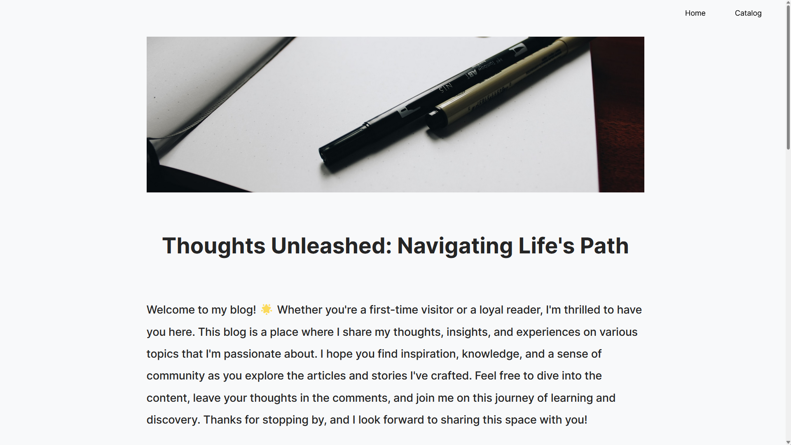

# Blog Project

This is the repository for a project where I was tasked with creating a static Blog website.

We were tasked with using what we had learned in the 4 weeks we spent learning about React and Vite. 
So for this project I made use of useState(), useEffect(), React Router, the useParams hook.

The contents found on this blog is from an object array I had made by ChatGPT with images from unsplashed.com

# [Visit here](https://blog-d3s.pages.dev/)

